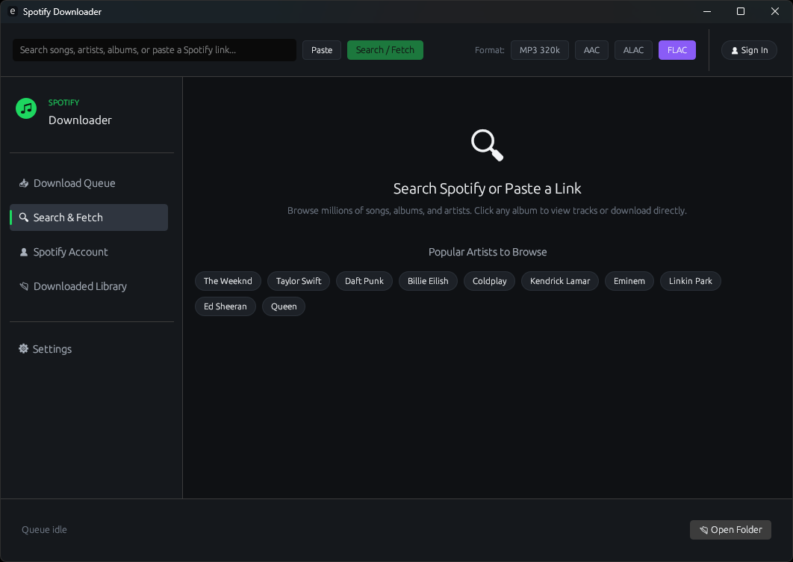
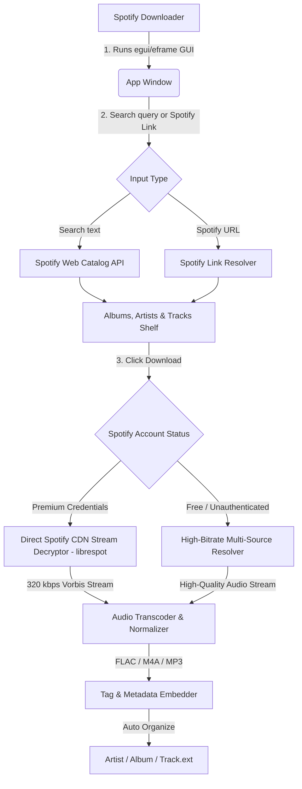

# 🎵 Spotify Downloader

[](https://github.com/MrJSA/spotifydownloader)
[](https://www.rust-lang.org)
[](https://github.com/emilk/egui)
[](https://github.com/librespot-org/librespot)
[](https://crates.io)
[](LICENSE)

A high-performance, modern cross-platform desktop application to search, browse, and download high-fidelity music from Spotify. Features a sleek, Fastpotify-inspired dark UI, dual download pipelines (direct Spotify CDN 320 kbps stream for Premium and multi-source fallback), rich embedded metadata, and automatic library organization—all packaged in a **zero-dependency, standalone application** using Rust and egui.

---

## 📦 How to Install & Run

1. Head over to the **[Releases](https://github.com/MrJSA/spotifydownloader/releases)** page.
2. Download the package for your operating system:
   * **Windows:** Download `SpotifyDownloader-Windows.exe` and run it directly.
   * **macOS:** Download `SpotifyDownloader-macOS.dmg`, double-click to mount, and drag the app to your `Applications` folder.
   * **Linux:** Download `SpotifyDownloader-Linux.tar.gz`, extract, and run `SpotifyDownloader`.

---

<p align="center">
  
</p>

---

## ✨ Key Features

| Feature | Description |
| :--- | :--- |
| **🎨 Fastpotify-Inspired UI** | Sleek, dark Spotify aesthetic (`#1ed760` accent) built with `egui` and `eframe` for 0 web bloat, instant launch, and 60 FPS responsiveness. |
| **⚡ Dual Download Pipeline** | Direct 320 kbps Vorbis decryption from Spotify Access Points (Premium) with automatic high-bitrate multi-source resolver fallback (Free & unauthenticated). |
| **🎧 Audiophile Quality Formats** | Complete format freedom: **FLAC** (Lossless), **M4A (ALAC Lossless)**, **WAV** (16-bit PCM), **AIFF** (Apple PCM), **M4A (256 kbps AAC)**, and **MP3** (320, 192, and 128 kbps). |
| **🔍 In-App Catalog Browsing** | Search artists, albums, and tracks directly inside the app with 1-click album downloads and artist discography navigation. |
| **🔗 Universal Link Support** | Paste any Spotify URL (track, album, playlist, artist, localized or mobile shortlinks) for immediate retrieval. |
| **🏷️ Rich Metadata & Cover Art** | Automatically embeds album artwork (`covr`, `APIC`, `METADATA_BLOCK_PICTURE`), tags (title, artist, album, year, track number), and saves `cover.jpg`. |
| **📂 Smart Organization** | Automatically sorts music into `{Artist}/{Album}/{TrackNumber} - {Title}.{ext}` with clean sanitized paths and zero stray temp files. |
| **💾 Persistent Settings** | Automatically saves your download folder, preferred audio format, and Spotify login state across app restarts. |
| **🔌 Standalone Executables** | Pre-built standalone native releases for Windows (`.exe`), macOS (`.dmg`), and Linux (`.tar.gz`). |

---

## 🛠 How It Works

The application combines a high-performance egui GUI with an asynchronous Rust audio engine and dual-stream pipeline:



---

## 💻 Developer Guide

If you'd like to clone the repository and build from source, follow this workflow:

### Workspace Pre-requisites
1. **Rust Toolchain**: Rust 1.80+ (Install via [rustup.rs](https://rustup.rs))
2. **FFmpeg**: Required for audio transcoding and stream extraction:
   * **Windows**: `winget install Gyan.FFmpeg` or `scoop install ffmpeg`
   * **macOS**: `brew install ffmpeg`
   * **Linux**: `sudo apt install ffmpeg libasound2-dev libx11-dev libgl1-mesa-dev libxkbcommon-dev libwayland-dev`

### Local Development Cycle
* **Run in Development**:
  ```bash
  cargo run
  ```
* **Run Test Suite**:
  ```bash
  cargo test
  ```
* **Build Standalone Release**:
  ```bash
  cargo build --release
  ```
  The compiled executable will be located in `target/release/`.

---

## ⚖️ Disclaimer

This software is developed strictly for educational, personal, and archival purposes. Please respect copyright laws and the terms of service of any media platforms you interact with.

---

## 📜 License

This project is licensed under the MIT License - see the [LICENSE](LICENSE) file for details.